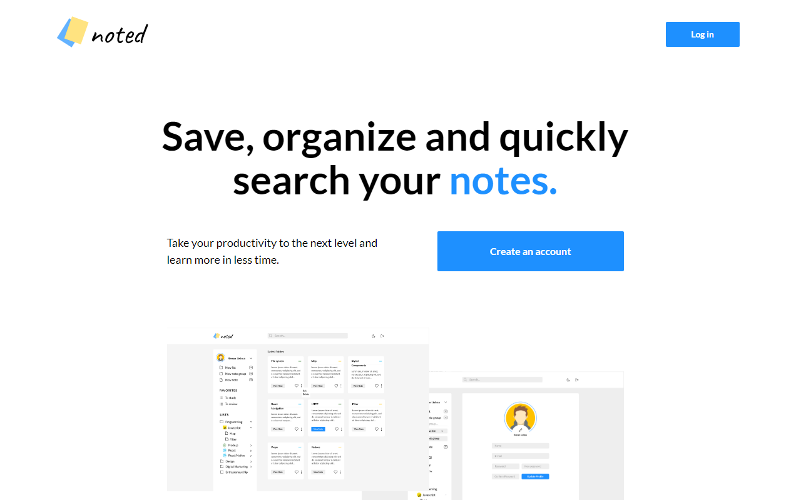

<h1 align="center">
    
</h1>

  <a href="#rocket-technologies">Technologies</a>&nbsp;&nbsp;&nbsp;|&nbsp;&nbsp;&nbsp;
  <a href="#-project">Project</a>&nbsp;&nbsp;&nbsp;|&nbsp;&nbsp;&nbsp;
  <a href="#memo-license">License</a>

  

 

  

## 🚀 Technologies

This project was developed with the following technologies:

- [Node.js](https://nodejs.org/en/)
- [React](https://reactjs.org)
- [React Native](https://facebook.github.io/react-native/)

## 💻 Project

Noted App is an application to save, organize and search study notes.

## :memo: License

This project is under the MIT license. See the [LICENSE](LICENSE.md) file for more details.

---

Made with ♥ by Renan Lisboa :wave: